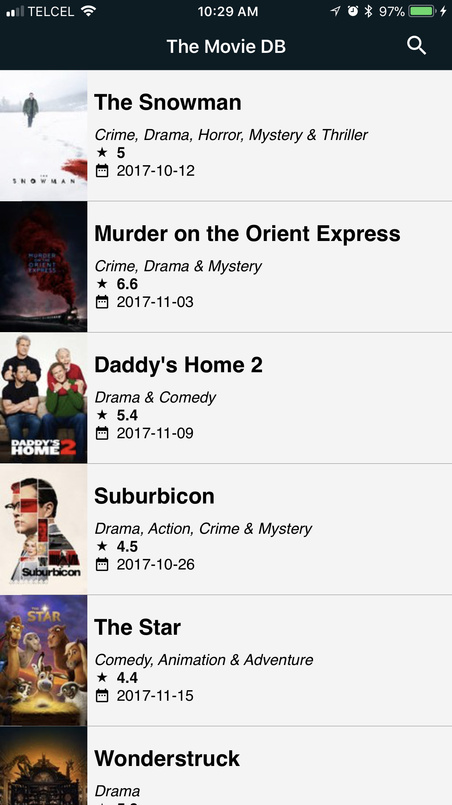
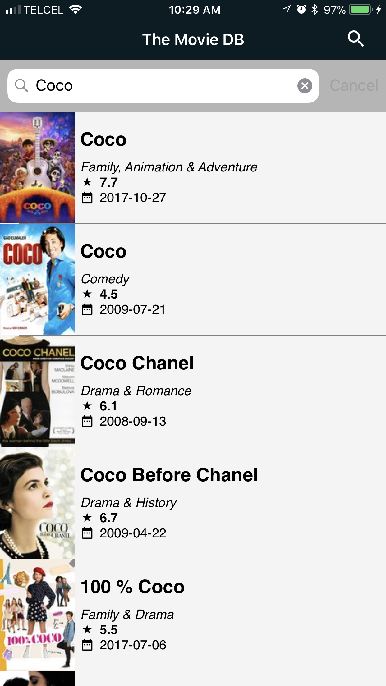
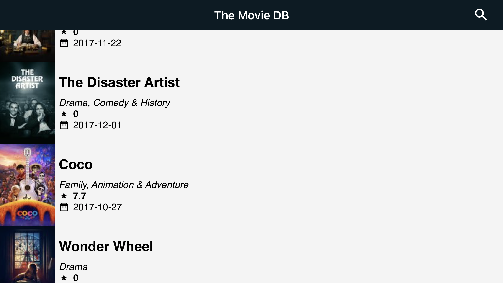
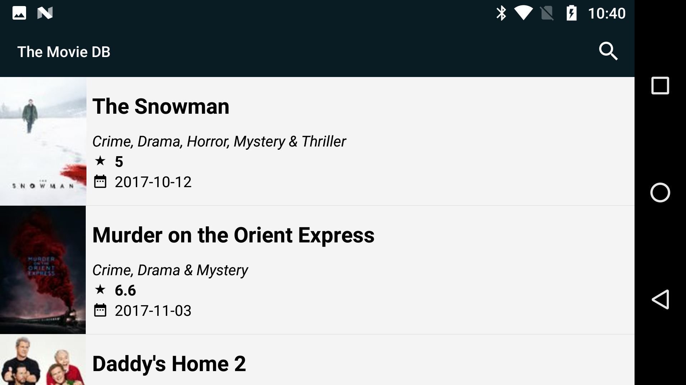

# MoviesMobileApp
Xamarin Forms: Movies Mobile App

## Libraries Used:

Microsoft.Net.Http: Cross-platformn http client allow to create web api calls via PCL in a fast and intuitive way, this library is used in the Service assembly

Newtonsoft.Json: Helper library that help to fast serialize and deserialize json/C# objects, this library is used in the service assembly and also to store complex objects as serialzed string into app settings 

Xamarin.Forms: Xamarin.Forms allow to create crossplatform apps that can share not only core code also UI layer items, this library is used as the core UI platform.

Xamarin.FFImageLoading.Forms: Helper Library that helps to create a very lighweight and performant Image controls in a simple way, this libs is used in almost all images controls that load Web based sources.

Xam.Plugin.Connectivity: Helper library that allow to detect all connectivity status and changes from devices, this lib is used in the main page to detect wheter user has o not internet.

Xam.Plugins.Settings: Helper library that allow to manage app settings stored into device, this lib is used to store serialized API settings and images sizes.

Refractored.MvvmHelpers: Helper class that contains a common tools for MVVM that allo to quickly create View Models impl., this lib is used inside all viewmodels that the app contains.

## Screenshoots

### iOS

### Android

